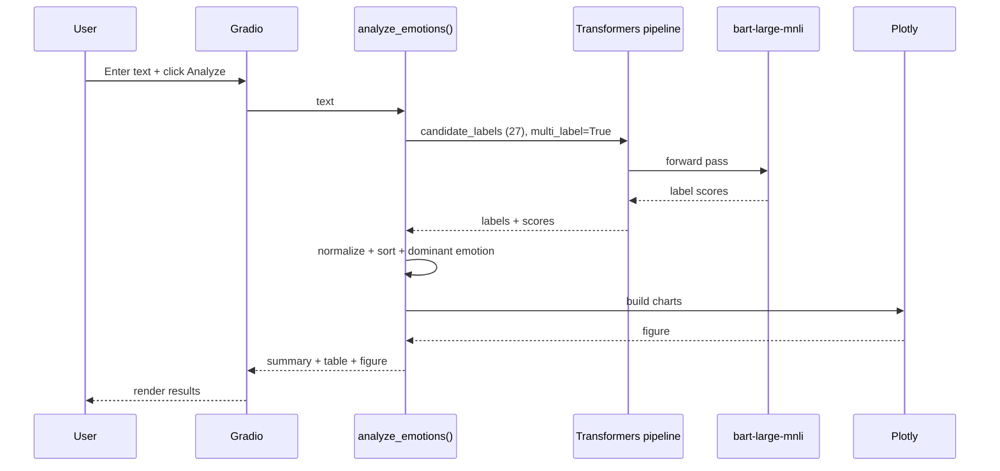

# Emotion Analysis App

Analyze emotions in text using **zero-shot classification** with `facebook/bart-large-mnli`. The app is built with **Gradio** and displays:

1. A dominant emotion summary
2. A full emotion breakdown table
3. A radar + bar comparison chart (top emotions)

## Live Demo

- **Hugging Face Space**: https://huggingface.co/spaces/shudipto001/sentiment_analyzer

## Features

- **Zero-shot, multi-label** emotion scoring across 27 nuanced emotions
- **GPU-aware** inference (`cuda` when available)
- **Interactive UI** with examples, breakdown table, and Plotly visualizations

## Architecture

```mermaid
flowchart LR
  U[User] -->|Text input| G[Gradio UI]
  G --> A[analyze_emotions]
  A -->|candidate_labels: 27 emotions| P[Transformers pipeline (zero-shot-classification)]
  P --> M[facebook/bart-large-mnli]
  M --> R[Scores per emotion]
  R --> N[Normalize scores (sum to 1)]
  N --> S[Summary (dominant emotion)]
  N --> T[Breakdown table]
  N --> C[Plotly chart (radar + bar)]
  S --> G
  T --> G
  C --> G
```

## Request Flow



## Emotions Detected

Admiration, Adoration, Aesthetic Appreciation, Amusement, Anger, Anxiety, Awe, Awkwardness, Boredom, Calmness, Confusion, Craving, Disgust, Empathic Pain, Entrancement, Excitement, Fear, Horror, Interest, Joy, Nostalgia, Relief, Romance, Sadness, Satisfaction, Sexual Desire, Surprise

## Getting Started (Local)

### Prerequisites

- Python 3.9+ recommended
- Enough disk space for the model download (the first run can download ~1.5GB)

### Install

```bash
pip install -r requirements.txt
```

### Run

```bash
python app.py
```

Then open `http://localhost:7860`.

## Configuration

- **Model download/cache**: Transformers will cache models automatically. You can control cache paths with environment variables like `HF_HOME` or `TRANSFORMERS_CACHE`.
- **GPU/CPU**: The app uses GPU automatically when `torch.cuda.is_available()`.

## Project Structure

```text
.
├── app.py
├── requirements.txt
└── README.md
```

## Notes

- Best results are typically with **English** text.
- CPU inference can take a few seconds; GPU inference is usually faster.

## License

MIT (see `LICENSE`).

## Developed by

**SUDIPTA ROY**
